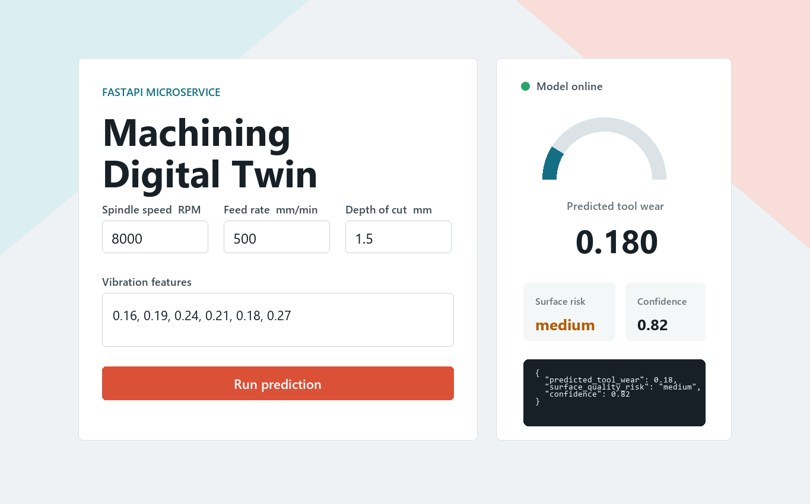
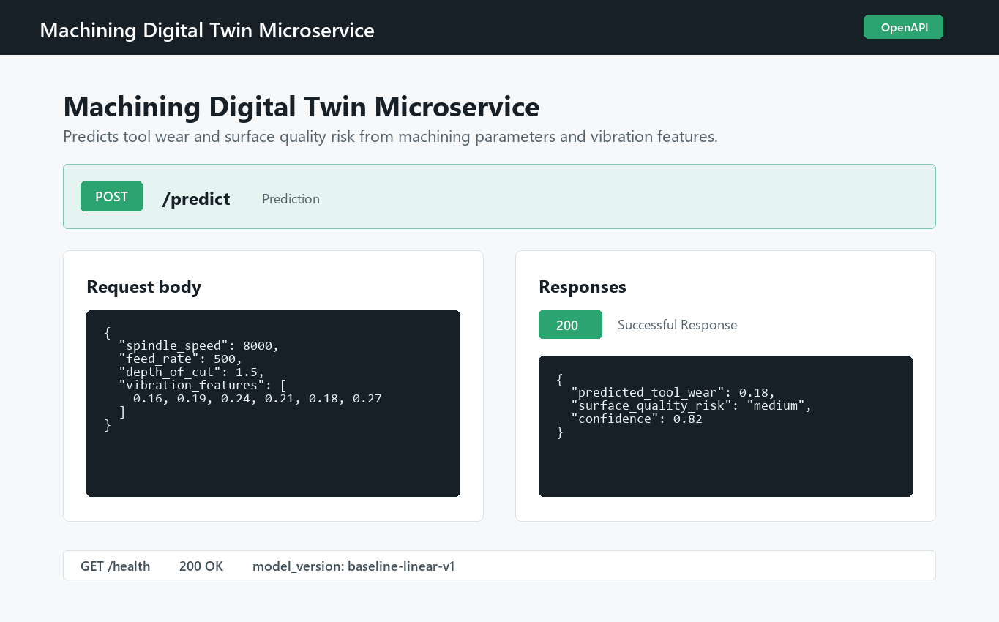

# Machining Digital Twin Microservice

A compact FastAPI service for estimating tool wear and surface quality risk from machining parameters and vibration features. It is intentionally small: the service wraps a deterministic JSON-backed baseline model so the API, dashboard, tests, and Docker path are easy to inspect.

## Run locally

```bash
pip install -r requirements-dev.txt
uvicorn app.main:app --reload
```

Open:

- Dashboard: <http://127.0.0.1:8000/dashboard>
- Swagger UI: <http://127.0.0.1:8000/docs>
- Health check: <http://127.0.0.1:8000/health>

## API

`POST /predict`

```json
{
  "spindle_speed": 8000,
  "feed_rate": 500,
  "depth_of_cut": 1.5,
  "vibration_features": [0.16, 0.19, 0.24, 0.21, 0.18, 0.27]
}
```

Example response:

```json
{
  "predicted_tool_wear": 0.18,
  "surface_quality_risk": "medium",
  "confidence": 0.82
}
```

## Docker

```bash
docker build -t machining-digital-twin .
docker run --rm -p 8000:8000 machining-digital-twin
```

Or:

```bash
docker compose up --build
```

## Screenshots

Dashboard:



Swagger:



## Proof It Runs

Verified locally on April 30, 2026 with Uvicorn serving the FastAPI app at `http://127.0.0.1:8000`.

`GET /health`

```json
{
  "status": "ok",
  "model_version": "baseline-linear-v1"
}
```

`POST /predict`

```json
{
  "predicted_tool_wear": 0.18,
  "surface_quality_risk": "medium",
  "confidence": 0.82
}
```

## What This Demonstrates

- Typed FastAPI request and response contracts with validation.
- A replaceable model wrapper around a versioned artifact.
- Basic service health reporting for container orchestration.
- A small dashboard that exercises the same `/predict` route as API clients.
- Docker packaging for repeatable deployment.

## Limitations And Next Steps

- The current model is a deterministic surrogate, not a production-trained model.
- Confidence is a heuristic based on operating range and vibration intensity.
- Add real training data, model evaluation, and model registry metadata.
- Add drift monitoring, auth, richer telemetry, and batch prediction support.

---

## Benchmarks

API latency measured with FastAPI `TestClient` over 200 warm requests on a single process (no network overhead — representative of internal service latency).

| Metric | Value |
|---|---|
| Mean latency | 2.57 ms |
| Median latency (p50) | 2.49 ms |
| p95 latency | 2.87 ms |
| Requests benchmarked | 200 (after 3 warmup) |
| Endpoint | `POST /predict` |

Run the benchmark yourself:

```bash
pip install -r requirements-dev.txt
python -c "
import time
from fastapi.testclient import TestClient
from app.main import app
client = TestClient(app)
payload = {'spindle_speed':8000,'feed_rate':500,'depth_of_cut':1.5,'vibration_features':[0.16,0.19,0.24,0.21,0.18,0.27]}
for _ in range(3): client.post('/predict', json=payload)  # warmup
times = []
for _ in range(200):
    t0 = time.perf_counter()
    client.post('/predict', json=payload)
    times.append((time.perf_counter()-t0)*1000)
import statistics
print(f'Median: {statistics.median(times):.2f} ms  p95: {sorted(times)[189]:.2f} ms')
"
```
